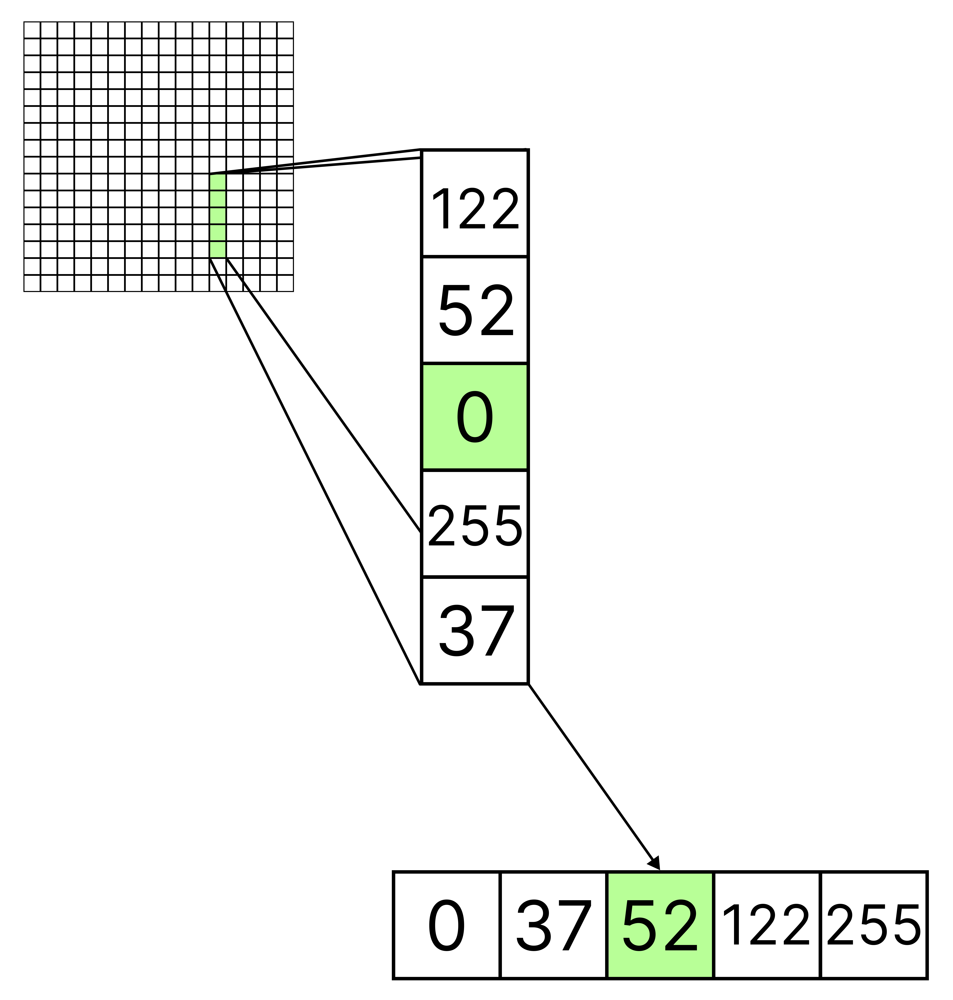

# Программа медианной фильтрации полутонового зашумленного изображения
## Автор
Разработчик: [Василий Фадеев]  
Email: vasiliy.fadeev.20@gmail.com  
GitHub: [https://github.com/VasilichFadeev]  
## Описание программы
По заданию требовалось написать программу со следующим функционалом:  
- **зашумления фото с уровнем 50%**,  
- **вертикальным медианным фильтром 5x1** в три прохода.

Дополнительно реализовано:
- функционал не только для загрузки **RAW-файлов 256x256**, но и обычных картинок (png, jpeg, ...), которые приводятся к чёрно-белому 8-битному формату.  
- сделано сохранение обработанных фото, добавлен функционал для применения медианного фильтра один раз.  

Технические сведения:  
- язык: **C++**,  
- стиль: **ООП**,  
- сборка: **Makefile**,  
- архитектура:  
  - класс **Picture**, который отвечает за загрузку, преобразование и обработку изображений,  
  - класс **View** реализует графический интерфейс и взаимодействие с **Picture**.

## Теория
### Вертикальный медианный фильтр 5x1
Этот фильтр используется для подавления импульсного шума, почти не искажая границы объектов. Он не относится к линейным фильтрам (тем, которые берут средние значения),  
вместо этого он берёт медианное значение в конкретном наборе данных (в случае с фильтром 5x1 — третий элемент).  
Наглядно можно посмотреть на этом рисунке:  

  

  

### Импульсный шум
Он генерирует изолированные точечные искажения в изображении, случайно заменяя отдельные пиксели на значения, которые сильно отличаются от исходных. Непосредственно в коде представляет собой цикл, в котором генерируется случайное значение в пределах [0, 1], и, если оно меньше целевого процента (0,5), пиксель заменяется на обработанный.  
## Оценка преподавателя

  

### Более подробное описание можно прочитать тут:
[РГЗ Фадеев.docx](./РГР%20Фадеев.docx)